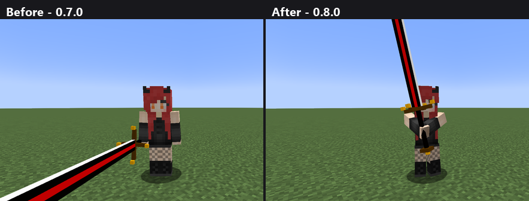
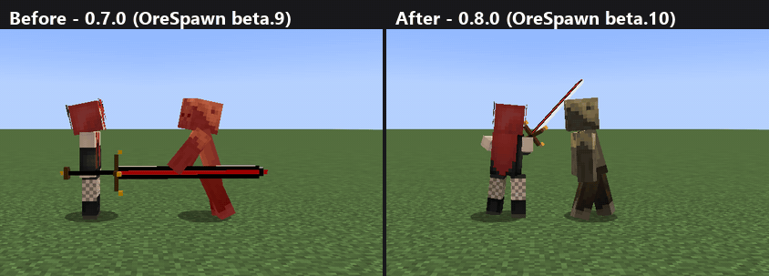
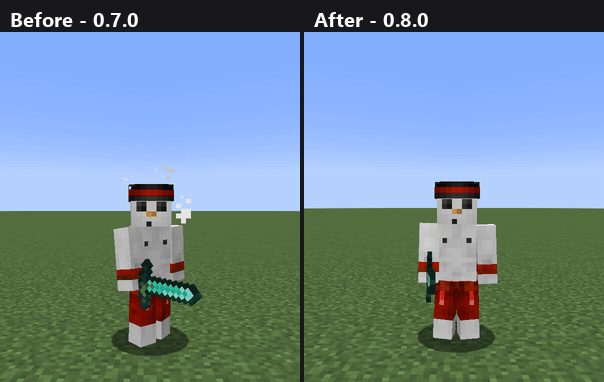

# OreSpawn Integrations 0.8.0

The Girlfriend and the Boyfriend move like players: a player animation pack animates them, and Better Combat's weapon
swings play on them. Better Combat's attacks also show properly on you again when a player animation pack is on.

## What changed
- The Girlfriend and the Boyfriend now use the player model, so Fresh Animations: Player Extension animates them the
  way it animates you: breathing, swaying, walking, running, falling, swimming, looking around.

  

  *Left, 0.7.0: OreSpawn's own model, Big Bertha held straight out to the side. Right, 0.8.0: the player model,
  gripping it with both hands the way Better Combat holds a claymore.*

- With Better Combat, they swing their weapons with that weapon's real attack animations, combos included. Two-handed
  weapons like the claymore are gripped with both hands, between swings too, and stay the right way round mid-swing.
  Each swing plays once and finishes, even when the game stutters, and their arms stay on their shoulders while they
  walk and run.

  

  *Left, 0.7.0: she hits without moving a muscle. Right, 0.8.0: Better Combat's overhead swing, slam, sweep and stab,
  back to her grip in between. The shoes she throws between swings come from OreSpawn 2.0.0-beta.10.*

- Fixed: with a player animation pack on, your own Better Combat attacks and two-handed weapon poses were drawn over
  by the pack. They show again, and the pack still animates everything the attack doesn't use.

  

  *Left, 0.7.0: the pack draws over the attack, so your body turns but the arm and sword hang down. Right, 0.8.0: the
  attack shows.*

- New settings in the mod's config: `player_model_bipeds`, `better_combat_bipeds` and `better_combat_on_players`,
  all on by default.
- Works with OreSpawn 2.0.0-beta.9 and later. With 2.0.0-beta.10 the pair also throw shoes between their swings again.

## Details
- **The pair on the player model.** With Entity Model Features or Better Combat installed, the Girlfriend and the
  Boyfriend are drawn with the vanilla player model (slim arms for her, as her original model had) instead of
  OreSpawn's own rig. Entity Model Features animates any model built from the player layer, so a player animation
  pack animates them as it animates you. Without such a pack they move as vanilla humanoids, which is how their
  original model moved. Their skins are the original 64x32 sheets, converted to the player layout as they load; a
  resource pack that retextures them is followed.
- **Better Combat swings on the pair**, played as Better Combat plays a player's: the weapon's attacks in turn, fitted
  to the weapon's attack speed, mirrored for a left-handed one, faded in from the previous swing, the whole-body twist
  included, the legs left to their stride while walking and the head left to its gaze. The weapon also turns in the hand
  as Better Combat turns a player's (without it a claymore hung upside down through overhead swings), and a weapon with
  an idle pose, such as a claymore or a heavy axe, is held in that pose between swings. Anything Better Combat does not
  know swings the vanilla way. A swing is taken from the server's swing message, one attack per swing: up to OreSpawn
  2.0.0-beta.9 the pair never advanced their own swing timer (vanilla only does that for monsters and players), so
  after their first swing they looked permanently mid-swing, and reading that as a new swing restarted the attack every
  other tick. A swing that arrives while the game stutters still plays: a swing is dropped only when the creature was
  not on screen as it arrived, and that is counted in frames, not game ticks (a lagging game runs several ticks before
  it draws the next frame).
- **Attacks and poses over an animation pack as offsets.** The pack moves the torso, head and shoulders as a body walks,
  bobs and leans, so Better Combat's part positions are laid over the pack's as offsets from rest instead of fixed
  spots, and arms stay attached to the body, for the pair and for players.
- **Attacks over an animation pack.** Entity Model Features animates a model after the game has posed it, so a player
  animation pack overwrites a Better Combat attack or weapon pose. This mod now lays the attack or pose back over the
  torso and arms right after the pack's animation, starting from the pack's own pose, so a swing eases in and out of
  the pack's motion instead of snapping. The same is done for players (`better_combat_on_players`). Entity Model
  Features' own per-part pause could not be used: in 3.2.4 its animations ignore it.
- **Config** (`[compat]`): `player_model_bipeds` (restart), `better_combat_bipeds`, `better_combat_on_players`.

## Notes
- Client-side only; nothing from Fresh Animations or Better Combat is copied into this mod. Their animations are read
  at run time from the packs and mods you have installed. Fresh Animations and its Player Extension are FreshLX's;
  their terms allow including the packs in a modpack.
- Hats on the pair now come from Hats Renewed's own placement for humanoid models, since they no longer use a rig.
- Everything else OreSpawn draws is unchanged.
