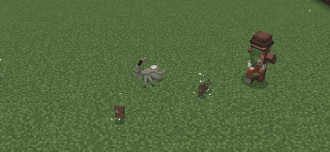

# OreSpawn Integrations 0.9.0

Monster Hunters now go after five of OreSpawn's lesser monsters: rats, scorpions, leaf monsters, cave fishers and
creeping horrors.

## What changed
- With Monster Hunter Villager 1.3.1 or later in the pack, Monster Hunters go after OreSpawn's rats, scorpions, cave
  fishers, creeping horrors and leaf monsters, on top of the zombies, spiders, skeletons and slimes they already hunt.
  They trap them and finish them with the knife the same way.

  

  *A Monster Hunter pins a scorpion with a sticky trap, then throws a sharpened trap at it.*

- Monster Hunter Villager is optional. If it is installed, it has to be 1.3.1 or later.

## Details
- The five are OreSpawn's lesser ground monsters, the ones a villager with a knife and a few traps can beat. On the
  surface that means rats in dark forests and taigas, scorpions in deserts, badlands, savannas and dark forests, and
  leaf monsters in forests at night. Cave fishers and creeping horrors live deep underground, so hunters only meet those in caves. The
  big predators (T-Rex, basilisk, mantis, trooper bug, the dinosaurs) stay the player's job: a hunter would lose those
  fights, and they are what the Big Game weapons are for. Ghosts and mosquitoes are left out because traps can't hold
  anything that flies, and worms because they burrow through the ground where no trap reaches them.
- The creatures are added through Monster Hunter Villager's `monster_hunter_villager:quarry` entity tag, so this is
  data only. A test checks every entry against the OreSpawn jar, because one wrong id would make the game drop the
  whole tag.
- Tested twice in a test world with the full pack: a Monster Hunter went after each of the five and a zombie, and
  left a mantis alone.
